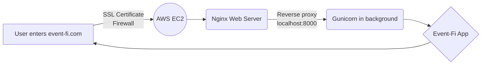

# Event-fi

>Event-Fi is an app designed to comfortably create, manage, share and find events, via a single simple app. It utilizes a map layout (using mapbox GL) based on markers for each location/event, in order to have an easy visualization and a user-friendly experience.

You can visit our Page and register to our app [here!](event-fi.com)

## Authors
> Martin Casamayou, as Backend Developer [ LinkedIn](https://www.linkedin.com/in/martin-casamayou-del-pino-24b554222/)

> Felipe Perez, as Frontend Developer [ LinkedIn](https://www.linkedin.com/in/felipe-pérez-86a77b165/)

> Diego Merentiel, as FullStack Developer  [ LinkedIn](https://www.linkedin.com/in/diego-merentiel)

> Santiago Goyret, as Project Manager and DevOps [ LinkedIn](https://www.linkedin.com/in/santiago-goyret)

## Infraestructure

### Dependencies
- Python 3.10.4
- Pip 22.0.2
- Werkzeug 2.1.2
- Flask 2.1.2
- Flask_Session 0.4.0
- Flask_Cors 3.0.10
- Flask_PyMongo 2.3.0
- PyMongo 4.1.1
- dnspython 2.2.1
- Nginx 1.18.0
- Gunicorn 20.1.0

### Installation
>On an Ubuntu 22.04 based server follow this next steps
- 1. Clone our repository

			$ git clone https://github.com/BergeDios/Event-fi.git
- 2.  Run our Configuration Script to install all dependencies

			 $ ./config.sh
- 3. You are done! The app is now running in the background in **localhost:8000**

> You can check the status of the service running **$ sudo systemctl status event-fi.service**. Also all the logs from the app down to debug level, are being redirected to **/var/log/gunicorn/stdout** and **/var/log/gunicorn/stderr**.

### App Architecture
>Our app has a basic infrastructure consisting of a server instance hosted via the AWS EC2 service. Then with the Nginx web server we reverse proxy our localhost, that is deploying our app via Gunicorn service in the background through the port 8000.
We also hold a second instance to the side enabling us to have a blue/green deployment strategy to reduce downtime and facilitate update deployments.

## Front-end
This web app, though responsive, is mainly focused on mobile usage. 
[ Desktop usage works as well ]. For this reason, it is highly recommended to be tested in small devices.

### Technologies implemented

 - 
 - 
 - 
 - 
 - 
 
 ## HTML5 & CSS3
 ### Documents
 HTML documents were designed with Jinja's templates engine. There is a *base.html* template which contains the main structure of almost every document on the app, this being inherited by the rest of templates.
Main structure being:

        
// Where all elements go
		    
 
		    

		    

		    

	    

### Styles
There is a style sheet for each template created, each one sharing characteristics like the color palette used. User experience is focused, with a simple interface.

## JavaScript
Js is used to request and display dynamic content from or to the API that was made. Visually speaking, it is used to make navigation bars and interactive buttons as well.
Script contents are divided into several functions, but no framework or library was used to make modules.

### Requesting data to the app's API
Simpler to explain with a code example, how is that the app handles communicating to its API?

 1. Firstly,  an XMLHTTPRequest object is made; for example, here it is getting information from an event.

>     var  request  =  new  XMLHttpRequest();
>     request.open('GET','/api/events/'  +  eventid);
>     request.setRequestHeader('Content-Type', 'application/json');
>     request.setRequestHeader('Access-Control-Allow-Origin', '*');
>     request.setRequestHeader('Access-Control-Allow-Headers', '*');
>     request.send();
2. Sends the request and, when that request is loaded and has a response, it parses the information obtained and displays it.
> 
>     request.onload  =  function() {
>     var  data  =  JSON.parse(request.responseText);
>     }

## Mapbox
  The app has an integrated map that is provided by Mapbox GL JS API. Whenever the event is clicked, the user will be redirected to a view which will display a map, giving geological information about the particular location requested.
 
 A more technical example of how the app communicates with the Mapbox API will be the following:
 

 1. It authenticates with a token and creates a map into the div that was specifically made to contain it.
 

>     const map = new mapboxgl.Map({
>     container: 'map', 
>     style: 'mapbox://styles/mapbox/light-v10', 
>     center: [geojson.geometry.coordinates[0], geojson.geometry.coordinates[1]],
>     zoom: 16
>     });

2. As seen, the center is specified with the location of the event.

  
  

## RestfulAPI
In order to retrieve data from the different models, the following routes are implemented.
*note that you need valid credentials in most of the functionalities*

### User routes
>    /api/users/<user_id>
##### GET ()
Returns the information of a given user

>    /api/users/<user_id>/contacts
##### GET ()
Returns a list with all the user contacts
##### POST (contact_id)
If the contact_id exists in the database, the contact info is added to the user contact list
##### DELETE (contact_id)
If the contact_id is found in the user contacts, it is removed from the list.

>    /api/users/<user_id>/notifications
##### GET (checking)
If checking is True, then it just returns a message signaling that the user has unread notifications.
If checking is False, then it returns the user notifications to the front and deletes them.

### Group routes
>.    /api/groups
##### GET ()
Returns a list with all the groups that the current logged user is part of.
##### POST ()
Adds a new group and sets the creator as owner and admin

>    /api/groups/<group_id>
##### GET ()
Returns the information of a given group (name, avatar, members and events)
##### PUT ()
Sends new form to update the group info
##### DELETE ()
Removes the group from all the relations and then deletes it from the database.

>    /api/groups/<group_id>/members
##### GET ()
Returns a list with all the members of a group.
##### POST (user_id, type)
If the user exists, it is added to the group members with its type if it is specified.
##### PUT (user_id, type)
Updates the type of a group member, in order to give or remove admin privileges.
##### DELETE (user_id)
Removes a member from the group.

>    /api/events
##### GET(filter)
Returns a list of all the upcoming events for the current logged user.
If the filter is specified with a date, then it will only show the events for that particular day.
##### POST()
Adds a new event setting the creator as owner and admin, also gives the possibility to invite groups or specific users in the creation form.

>    /api/events/<event_id>
##### GET ()
Returns the information of a given event (name, avatar, start_date, end_date, location, groups, members)
##### PUT ()
Updates the information of the event through a form.
##### DELETE ()
Removes the event from all the collections it is related to and then deletes it from the database.

>    /api/events/<event_id>/members
##### GET ()
Returns a list with the information of all the members of a given event.
##### POST (user_id, type)
Adds a new member to the event with a member type if specified.
##### PUT (user_id, type)
Updates the type of a given member, used for managing admin privileges.
##### DELETE (user_id)
Removes a member from the event.

>     /api/events/<event_id>/groups
##### GET ()
Returns a list with the information of all the groups of a given event.
##### POST (group_id)
Adds all the members from the group to the event member list and also the group itself to the event group list.
##### DELETE (group_id)
Removes all the group members and the group itself from the event.

